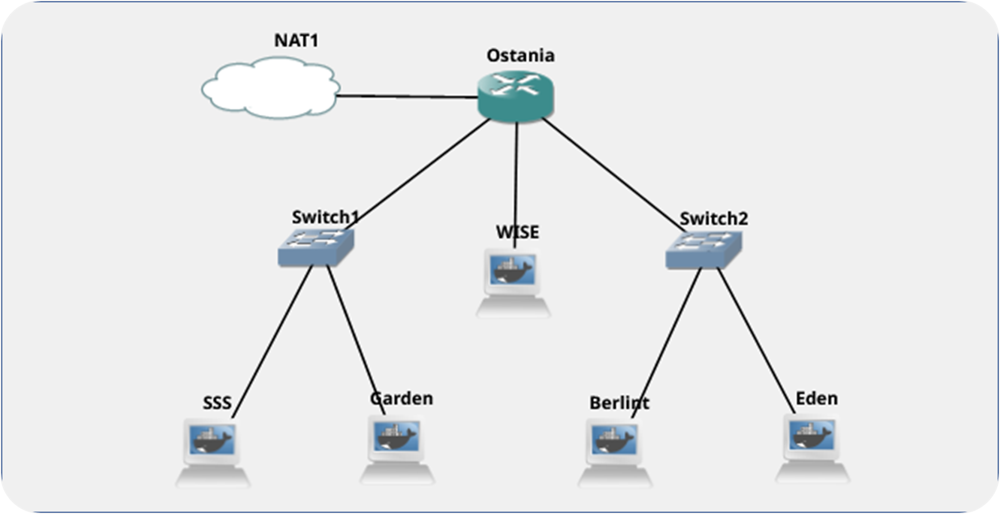

# Laporan Praktikum JARKOM 2 Kelompok B07 #

## Detail Anggota Kelompok

| Nama                      | NRP           |
| ------------------------- | ------------- |
| Danial Farros Maulana     | 5025201004    |
| Rendi Dwi Francisko       | 5025201056    |
| Ahmad Ibnu Malik Rahman   | 5025201232    |

## Topologi ##
file .gns3project dapat di akses pada link berikut [disini](b07.gns3project)

## Pendahuluan Praktikum ##
Twilight (〈黄昏 (たそがれ) 〉, <Tasogare>) adalah seorang mata-mata yang berasal dari negara Westalis. Demi menjaga perdamaian antara Westalis dengan Ostania, Twilight dengan nama samaran Loid Forger (ロイド・フォージャー, Roido Fōjā) di bawah organisasi WISE menjalankan operasinya di negara Ostania dengan cara melakukan spionase, sabotase, penyadapan dan kemungkinan pembunuhan

## Pembahasan soal Modul ##

### Nomer 1 ###
WISE akan dijadikan sebagai DNS Master, Berlint akan dijadikan DNS Slave, dan Eden akan digunakan sebagai Web Server. Terdapat 2 Client yaitu SSS, dan Garden. Semua node terhubung pada router Ostania, sehingga dapat mengakses internet.

**Jawab :**



pembuatan topologi diatas dilakukan pada webpage gns3 dan mengunakan konfigurasi yang berbeda beda di setiap nodenya, detail konfigurasi dapat di lihat pada tampilan berikut :

#### (DNS Master) Wise ####

network configuration

```sh
auto eth0
iface eth0 inet static
	address 192.176.2.2
	netmask 255.255.255.0
	gateway 192.176.2.1
```

Basic Configuration

```
echo 'nameserver 192.168.122.1' > /etc/resolv.conf
apt-get update
apt-get install bind9 -y
mkdir /etc/bind/wise
```

### (DNS Slave) Berlint ###

network configuration

```
auto eth0
iface eth0 inet static
	address 192.176.3.2
	netmask 255.255.255.0
	gateway 192.176.3.1
```

Basic Configuration

```
echo nameserver 192.168.122.1 > /etc/resolv.conf
apt-get update
apt-get install bind9 -y
mkdir /etc/bind/operation
```
#### (Web Server) Eden ####

network configuration

```
auto eth0
iface eth0 inet static
	address 192.176.3.3
	netmask 255.255.255.0
	gateway 192.176.3.1
```
Basic Configuration
```
echo nameserver 192.168.122.1 > /etc/resolv.conf
apt-get install nano -y
apt-get install bind9 -y
apt-get install apache2 -y
apt-get install php -y
apt-get install libapache2-mod-php7.0
service apache2 start
apt-get install ca-certificates openssl -y
apt-get install unzip -y
apt-get install git -y
git clone https://github.com/Rendyfranzz/resourcejarkom2.git
unzip -o /resourcejarkom2/\*.zip -d /Resourcegan
```

### (Client) SSS ###
network configuration

```
auto eth0
iface eth0 inet static
	address 192.176.1.2
	netmask 255.255.255.0
	gateway 192.176.1.1
```

Basic Configuration
```
echo nameserver 192.168.122.1 > /etc/resolv.conf
apt-get update
apt-get install dnsutils -y
apt-get install lynx -y
echo nameserver 192.176.2.2 > /etc/resolv.conf
echo nameserver 192.176.3.2 >> /etc/resolv.conf
```
### (Client) Garden ###
network configuration
```
auto eth0
iface eth0 inet static
	address 192.176.1.3
	netmask 255.255.255.0
	gateway 192.176.1.1
```

Basic Configuration
```
echo nameserver 192.168.122.1 > /etc/resolv.conf
apt-get update
apt-get install dnsutils -y
apt-get install lynx -y
echo nameserver 192.176.2.2 > /etc/resolv.conf
echo nameserver 192.176.3.2 >> /etc/resolv.conf
```
### Nomer 2 ###
Untuk mempermudah mendapatkan informasi mengenai misi dari Handler, bantulah Loid membuat website utama dengan akses wise.b07.com dengan alias www.wise.b07.com pada folder wise

**Jawab :**

Pada node **Wise** lakukan perintah sebagai berikut :
- edit file `/etc/bind/named.conf.local` dengan cara
  
  ```
  nano /etc/bind/named.conf.local
  ```
- mengisi konfigurasi dengan domain wise.b07.com sesuai dengan syntax berikut :
    ```
    zone "wise.b07.com" {
        type master;
          notify yes;
          also-notify {192.176.3.2;};
          allow-transfer {192.176.3.2;};
        file "/etc/bind/wise/wise.b07.com";
    };
    ```
- membuat folder `wise` di dalam folder `/etc/bind`, dengan cara :
  
    ```
    mkdir /etc/bind/wise.b07.com
    ```
- Mencoppy file db.local pada /etc/bind ke dalam folder wise yang baru saja dibuat dan ubah namanya menjadi wise.b07.com, menggunakan syntax 
    ```
    cp /etc/bind/db.local /etc/bind/wise/wise.b07.com
    ```
- Mengisi konfigurasi pada file `wise.b07.com`, sesuaikan dengan berikut :
    ```
    ;
    ; BIND data file for local loopback interface
    ;
    $TTL    604800
    @       IN      SOA     wise.b07.com. root.wise.b07.com. (
                            2022102401      ; Serial
                            604800         ; Refresh
                            86400         ; Retry
                            2419200         ; Expire
                            604800 )       ; Negative Cache TTL
    ;
    @       IN      NS      wise.b07.com.
    @       IN      A       192.176.2.2
    www     IN      CNAME   wise.b07.com.
    ```
- lakuakan restart server **bind9** dengan syntax berikut :
    ```
    service bind9 restart
    ```
    atau restart dapat menggunakan perintah berikut
    ```
    named -g
    ```

Pada node **client** (SSS dan Garden) lakukan perintah sebagai berikut :
- edit konfigurasi `resolv.conf` pada file `/etc/resolv.conf` dengan perintah beriut :
    ```
    nano /etc/resolv.conf
    ```
- isi file tersebut dengan IP dari Wise agar client mengenali domain,
    ```
    nameserver 192.176.2.2
    ```
- untuk mencoba koneksi DNS, lakukan ping pada domain yang sudah dibuat dengan :
  ```
  ping wise.b07.com
  ```
- client berhasil terkoneksi jika response ping seperti tampilan berikut :
  
  

  

  
### Nomer 3 ###
Setelah itu ia juga ingin membuat subdomain eden.wise.b07.com dengan alias www.eden.wise.b07.com yang diatur DNS-nya di WISE dan mengarah ke Eden

**Jawab**

Pada node **wise** lakukan perintah sebagai berikut :
- edit file `wise.b07.com` pada folder `/etc/bind/wise` dengan cara :
    ```
    nano /etc/bind/wise/wise.b07.com
    ```
- tambahkan konfigurasi subdomain pada file `wise.b07.com`, sehingga menjadi seperti berikut
    ```
    ;
    ; BIND data file for local loopback interface
    ;
    $TTL    604800
    @       IN      SOA     wise.b07.com. root.wise.b07.com. (
                            2022102401      ; Serial
                            604800         ; Refresh
                            86400         ; Retry
                            2419200         ; Expire
                            604800 )       ; Negative Cache TTL
    ;
    @           IN      NS      wise.b07.com.
    @           IN      A       192.176.2.2
    www         IN      CNAME   wise.b07.com.
    eden        IN      A       192.176.3.3
    www.eden    IN      CNAME   eden.wise.b07.com.
    ```
- lakuakan restart server **bind9** dengan syntax berikut :
    ```
    service bind9 restart
    ```
    atau restart dapat menggunakan perintah berikut
    ```
    named -g
    ```
- untuk mencoba koneksi subdomain, lakukan ping pada domain yang sudah dibuat dengan :
  ```
  ping eden.wise.b07.com
  ```
- client berhasil terkoneksi dengan sub domain jika response ping seperti tampilan berikut :
  
    

    

### Nomer 4 ###
Buat juga reverse domain untuk domain utama

**jawab**

Pada node **wise** lakukan perintah sebagai berikut :
- edit file `named.conf.local` pada folder `/etc/bind/` dengan cara :
    ```
    nano /etc/bind/named.conf.local
    ```
- tambahkan konfigurasi reserve domain sehingga pada file `named.conf.local`, sehingga menjadi seperti berikut
    ```
    zone "wise.b07.com" {
            type master;
            file "/etc/bind/wise/wise.b07.com";
    };
    zone "2.176.192.in-addr.arpa" {
        type master;
        file "/etc/bind/wise/2.176.192.in-addr.arpa";
    };
    ```
- Copykan file db.local pada path /etc/bind ke dalam folder wise yang baru saja dibuat dan ubah namanya menjadi 2.176.192.in-addr.arpa
- edit file `2.176.192.in-addr.arpa` dengan menggunakan perintah :
  ```
  nano /etc/bind/wise/2.168.192.in-addr.arpa
  ```
- sesuaikan konfigurasi sehingga terlihat sebagai berikut :
    ```
    ;
    ; BIND data file for local loopback interface
    ;
    $TTL    604800
    @       IN      SOA     wise.b07.com. root.wise.b07.com. (
                            2022102401      ; Serial
                            604800         ; Refresh
                            86400         ; Retry
                            2419200         ; Expire
                            604800 )       ; Negative Cache TTL
    ;
    2.176.192.in-addr.arpa. IN      NS      wise.b07.com.
    2                       IN      PTR     wise.b07.com.
    '
    ```
- lakuakan restart server **bind9** dengan syntax berikut :
    ```
    service bind9 restart
    ```
    atau restart dapat menggunakan perintah berikut
    ```
    named -g
    ```
- untuk mencoba konfigurasi, lakukan install `dnsutiils` pastikan name server merupakan IP dari ostania dengan:
    ```
    apt-get update
    apt-get install dnsutils
    ```
- kembalikan nameserver pada `/etc/resolv.conf` dengan IP wise, dan lakukan :
    ```
    host -t PTR "192.176.2.2"
    ```
- konfigurasi berhasil jika tampilan terlihat sebagai berikut :
  
  

### Nomer 5 ###
Agar dapat tetap dihubungi jika server WISE bermasalah, buatlah juga Berlint sebagai DNS Slave untuk domain utama

**jawab**
Pada node **wise** lakukan perintah sebagai berikut :
- edit file `named.conf.local` pada folder `/etc/bind/` dengan cara :
    ```
    nano /etc/bind/named.conf.local
    ```
- tambahkan konfigurasi reserve domain sehingga pada file `named.conf.local`, sehingga menjadi seperti berikut :
  ```
    zone "wise.b07.com" {
            type master;
            notify yes;
            also-notify {192.176.3.2;};
            allow-transfer {192.176.3.2;};
            file "/etc/bind/wise/wise.b07.com";
    };
    zone "2.176.192.in-addr.arpa" {
        type master;
        file "/etc/bind/jarkom/2.176.192.in-addr.arpa";
    };
    ```
- lakuakan restart server **bind9** dengan syntax berikut :
    ```
    service bind9 restart
    ```
    atau restart dapat menggunakan perintah berikut
    
    ```
    named -g
    ```
Pada node **Berlint** lakukan perintah sebagai berikut :
- terlebih dahulu lakukan update package lists dengan menjalankan command:
    
    ```
    apt-get update
    ```
- lakuakn update silahkan install aplikasi bind9 pada Berlint dengan perintah:
   
    ```
    apt-get install bind9 -y
    ```
- edit file /etc/bind/named.conf.local dengan menggunakan :
    
    ```
    nano /etc/bind/named.conf.local
    ```
- tambahkan sytax berikut :
    ```
    zone "operation.wise.b07.com" {
    type master;
    file "/etc/bind/operation/operation.wise.b07.com";
    };
    ```
- lakuakan restart server **bind9** dengan syntax berikut :
    ```
    service bind9 restart
    ```
    atau restart dapat menggunakan perintah berikut
    
    ```
    named -g
    ```
Proses testing dapat dilakukan dengan mematikan server bind9 pada wise dengan sytax :
```
service bind9 stop
```
pada **client** (SSS dan Garden) lakukan hal berikut :
- edit file seolv.conf dan tambahkan `IP berlint` Sehingga terlihat seperti berikut :
    ```
    nameserver 192.176.2.2 #ip Wise
    nameserver 192.176.3.2 #ip Berlint
    ```
- client berhasil terkoneksi jika response ping seperti tampilan berikut :
  
  

### Nomer 6 ###
Karena banyak informasi dari Handler, buatlah subdomain yang khusus untuk operation yaitu operation.wise.b07.com dengan alias www.operation.wise.b07.com yang didelegasikan dari WISE ke Berlint dengan IP menuju ke Eden dalam folder operation 

**Jawab**

Pada node **Wise** lakukan perintah sebagai berikut :
- edit file /etc/bind/wise/wise.B07.com dengan menggunakan :
    
    ```
    nano /etc/bind/wise/wise.B07.com
    ```
- sesuaikan konfigurasi sehingga tampak sebagai berikut :
    ```
    ns1             IN      A       192.176.3.2
    operation       IN      NS      ns1
    ```
- edit file /etc/bind/named.conf.options dengan menggunakan :
    
    ```
    nano /etc/bind/named.conf.options
    ```
- sesuaikan konfigurasi sehingga tampak sebagai berikut :
    ```
    options {
            directory "/var/cache/bind";
            allow-query{any;};
            auth-nxdomain no;    # conform to RFC1035
            listen-on-v6 { any; };
    };
    ```
Pada node **Berlint** lakukan perintah sebagai berikut :
- edit file /etc/bind/operation/operation.wise.B07.com dengan menggunakan :
    
    ```
    nano /etc/bind/operation/operation.wise.B07.com
    ```
- sesuaikan konfigurasi sehingga tampak sebagai berikut :
    ```
    ;
    ; BIND data file for local loopback interface
    ;
    $TTL    604800
    @       IN      SOA     operation.wise.b07.com. root.operation.wise.b07.com. (
                            2022102401      ; Serial
                            604800         ; Refresh
                            86400         ; Retry
                            2419200         ; Expire
                            604800 )       ; Negative Cache TTL
    ;
    @           IN      NS      operation.wise.b07.com.
    @           IN      A       192.176.3.3
    www         IN      CNAME   operation.wise.b07.com.
    ```
- edit file /etc/bind/named.conf.options dengan menggunakan :
    
    ```
    nano /etc/bind/named.conf.options
    ```
- sesuaikan konfigurasi sehingga tampak sebagai berikut :
    ```
    options {
            directory "/var/cache/bind";
            // forwarders {
            //      0.0.0.0;
            // };
            //dnssec-validation auto;
            allow-query{any;};
            auth-nxdomain no;    # conform to RFC1035
            listen-on-v6 { any; };
    };
    ```
- lakuakan restart server **bind9** dengan syntax berikut :
    ```
    service bind9 restart
    ```
    atau restart dapat menggunakan perintah berikut
    
    ```
    named -g
    ```
untuk mengetahui apakah konfigurasi sudah benar, Pada node **Client** (SSS dan Garden) lakukan ping dengan sytax:
```
operation.wise.b07.com
```
konfigurasi dikatakan benar jika hasil ping sebagai berikut:


### Nomer 7 ###
Untuk informasi yang lebih spesifik mengenai Operation Strix, buatlah subdomain melalui Berlint dengan akses strix.operation.wise.b07.com dengan alias www.strix.operation.wise.b07.com yang mengarah ke Eden

**jawab**

Pada node **Berlint** lakukan perintah sebagai berikut :
- edit file /etc/bind/operation/operation.wise.B07.com dengan menggunakan :
    
    ```
    nano /etc/bind/operation/operation.wise.B07.com
    ```
- sesuaikan konfigurasi sehingga tampak sebagai berikut :
    ```
    ;
    ; BIND data file for local loopback interface
    ;
    $TTL    604800
    @       IN      SOA     operation.wise.b07.com. root.operation.wise.b07.com. (
                            2022102401      ; Serial
                            604800         ; Refresh
                            86400         ; Retry
                            2419200         ; Expire
                            604800 )       ; Negative Cache TTL
    ;
    @           IN      NS      operation.wise.b07.com.
    @           IN      A       192.176.3.3
    www         IN      CNAME   operation.wise.b07.com.
    strix    IN      A       192.176.3.3
    www.strix     IN      CNAME   strix.operation.wise.b07.com.
    ```
- lakuakan restart server **bind9** dengan syntax berikut :
    ```
    service bind9 restart
    ```
    atau restart dapat menggunakan perintah berikut
    
    ```
    named -g
    ```
untuk mengetahui apakah konfigurasi sudah benar, Pada node **Client** (SSS dan Garden) lakukan ping dengan sytax:
```
strix.operation.wise.b07.com
```
konfigurasi dikatakan benar jika hasil ping sebagai berikut :


### Nomer 8 ###
Setelah melakukan konfigurasi server, maka dilakukan konfigurasi Webserver. Pertama dengan webserver www.wise.b07.com. Pertama, Loid membutuhkan webserver dengan DocumentRoot pada /var/www/wise.b07.com

**jawab**


Pada node **eden** lakukan perintah sebagai berikut :
- lakukan instalasi apache2 dengan menggunakan syntax berikut:
    ```
    apt-get install apache2 -y
    ```
- lakukan instalasi php dengan menggunakan syntax berikut: 

    ```
    apt-get install php -y
    apt-get install libapache2-mod-php7.0
    ```
- aktfkan service apache2 dengan menggunakan syntax berikut

    ```
    service apache2 start
    ```
- edit file `/etc/apache2/sites-available/wise.b07.com.conf` dengan menggunakan perintah
    ```
    nano /etc/apache2/sites-available/wise.b07.com.conf
    ```
- sesuaikan konfigurasi sehingga tampak sebagai berikut :
    ```
    <VirtualHost *:80>
            ServerAdmin webmaster@localhost
            DocumentRoot /var/www/wise.b07.com
            ServerName wise.b07.com
            ServerAlias www.wise.b07.com
            ErrorLog \${APACHE_LOG_DIR}/error.log
            CustomLog \${APACHE_LOG_DIR}/access.log combined
    </VirtualHost>
    ```
- aktifkan konfigurasi 'wise.b07.com.conf' dengan menggunakan
    ```
    a2ensite /etc/apache2/sites-available/wise.b07.com.conf
    ```
- membuat folder wise.b07.com sebagai repository website
    ```
    mkdir /var/www/wise.b07.com
    ```
- untuk mengisi folder `wise.b07.com` telah disediakan repository dan dapat di dowload dengan syntax berikut :
    ```
    apt-get install ca-certificates openssl -y
    apt-get install unzip -y
    apt-get install git -y
    git clone https://github.com/Rendyfranzz/resourcejarkom2.git
    ```
- coppy isi file yang sudah di download dan pindahka ke folder `wise.b07.com` dengan syntax :
    ```
    cp -r /Resourcegan/wise/. /var/www/wise.b07.com
    ```
- lakuakan restart server **bind9** dengan syntax berikut :
    ```
    service bind9 restart
    ```
    atau restart dapat menggunakan perintah berikut
    ```
    named -g
    ```
untuk mengecek konfigurasi webserver sudah tepat dapat melakukan hal berikut pada node **Client** (SSS dan Garden) :
- lakukan instalasi `dnsutils` dengan menggunakan sytax berikut :
    
    ```
    apt-get install dnsutils -y
    ```
- lakukan instalasi lynx dengan menggunakan
    
    ```
    apt-get install lynx -y
    ```
- cek koneksi dengan menggunakan perintah
    ```
    lynx  www.wise.b07.com
    ```
- konfigurasi dapat dikatakan benar jika keluaran sebagai berikut
    
    
### Nomer 9 ###
Setelah itu, Loid juga membutuhkan agar url www.wise.b07.com/index.php/home dapat menjadi menjadi www.wise.b07.com/home

**jawab**
Pada node **eden** lakukan perintah sebagai berikut :
- edit file `/etc/apache2/sites-available/wise.b07.com.conf` dengan menggunakan perintah

    ```
    nano /var/www/wise.b07.com/.htaccess
    ```
- sesuaikan konfigurasi sehingga tampak sebagai berikut
    ```
    RewriteEngine On
    RewriteCond %{REQUEST_FILENAME} !-f
    RewriteCond %{REQUEST_FILENAME} !-d
    RewriteRule (.*) /index.php/\$1 [L]
    ```
- edit file `/etc/apache2/sites-available/wise.b07.com.conf` dengan menggunakan perintah

    ```
    nano /etc/apache2/sites-available/wise.b07.com.conf
    ```
- sesuaikan konfigurasi sehingga tampak sebagai berikut
    ```
    <VirtualHost *:80>
            ServerAdmin webmaster@localhost
            DocumentRoot /var/www/wise.b07.com
            ServerName wise.b07.com
            ServerAlias www.wise.b07.com
            ErrorLog \${APACHE_LOG_DIR}/error.log
            CustomLog \${APACHE_LOG_DIR}/access.log combined
            <Directory /var/www/wise.b07.com>
                    Options +FollowSymLinks -Multiviews
                    AllowOverride All
            </Directory>
    </VirtualHost>
    ```
- lakukan restart service `apache2` dengan menggunakan syntax berikut :
    ```
    service apache2 restart
    ```
untuk mengecek konfigurasi. pada node **Client** (SSS dan Garden) lakukan perintah sebagai berikut :
```
lynx www.wise.b07.com/index.php/home
```
konfigurasi dapat dikatakan benar jika keluaran sebagai berikut
    


### Nomer 10, 11, 12, 13 ###

Setelah itu, pada subdomain www.eden.wise.b07.com, Loid membutuhkan penyimpanan aset yang memiliki DocumentRoot pada /var/www/eden.wise.b07.com, Akan tetapi, pada folder /public, Loid ingin hanya dapat melakukan directory listing saja, Tidak hanya itu, Loid juga ingin menyiapkan error file 404.html pada folder /error untuk mengganti error kode pada apache, Loid juga meminta Franky untuk dibuatkan konfigurasi virtual host. Virtual host ini bertujuan untuk dapat mengakses file asset www.eden.wise.b07.com/public/js menjadi www.eden.wise.b07.com/js

**jawab**

Pada node **eden** lakukan perintah sebagai berikut :
- edit file `/etc/apache2/sites-available/eden.wise.b07.com.conf`dengan menggunakan perintah

    ```
    nano /etc/apache2/sites-available/eden.wise.b07.com.conf
    ```
- sesuaikan konfigurasi sehingga tampak sebagai berikut
    ```
    <VirtualHost *:80>
            ServerAdmin webmaster@localhost
            DocumentRoot /var/www/eden.wise.b07.com
            ServerName eden.wise.b07.com
            ServerAlias www.eden.wise.b07.com
            <Directory /var/www/eden.wise.b07.com>
                    Options +Indexes
            </Directory>
            <Directory /var/www/eden.wise.b07.com/public>
                    Options +Indexes
            </Directory>
            ErrorDocument 404 /error/404.html
            Alias \"/js\" \"/var/www/eden.wise.b07.com/public/js\"
            ErrorLog \${APACHE_LOG_DIR}/error.log
            CustomLog \${APACHE_LOG_DIR}/access.log combined
            <Directory /var/www/eden.wise.b07.com>
                    Options +FollowSymLinks -Multiviews
                    AllowOverride All
            </Directory>
    </VirtualHost>
    ```
- aktifkan konfigurasi 'wise.b07.com.conf' dengan menggunakan
    ```
    a2ensite /etc/apache2/sites-available/wise.b07.com.conf
    ```
- buat file directory `eden.wise.b07.com` dengan menggunakan :

    ```
    mkdir /var/www/eden.wise.b07.com
    ```
- coppy file resource menuju folder `eden.wise.b07.com` dengan menggunakan sntax berikut :
    ```
    cp -r /Resourcegan/eden.wise/. /var/www/eden.wise.b07.com
    ```
- lakuakan restart server **bind9** dengan syntax berikut :
    ```
    service bind9 restart
    ```
    atau restart dapat menggunakan perintah berikut
    ```
    named -g
    ```
untuk mengecek konfigurasi, pada node **client** (SSS dan Garden) lakukan perintah sebagai berikut :
- cek folder yang sudah dibuat, dengan menggunakan
    ```
    cd \var\www\
    ls
    ```
    konfigurasi dapat dikatakan benar jika tampilan terlihat sebagai berikut :
    

- lakuakan pemanggilan situs `www.eden.wise.b07.com/js` dengan menggunakan 
    ```
    lynx www.eden.wise.b07.com/js
    ```
    konfigurasi dapat dikatakan benar jika tampilan terlihat sebagai berikut :
    
    
- tampilan situs jika situs tidak ditemukan akan muncul sebagai berikut :

    

### Nomer 14 ###
Loid meminta agar www.strix.operation.wise.yyy.com hanya bisa diakses dengan port 15000 dan port 15500

**Jawab :**

pada eden buat config baru dengan ```nano /etc/apache2/sites-available/strix.operation.wise.b07.com.conf ```


kemudian aktifkat dengan ```a2ensite strix.operation.wise.b07.com```
kemudian edit juga pada ```/etc/apache2/ports.conf ``` seperti berikut


dan jangan lupa untuk copy resourcenya ``` cp -r /Resourcegan/strix.operation.wise/. /var/www/strix.operation.wise.b07.com/ ```
Kemudian tes dengan ``` lynx strix.operation.wise.b07.com:15000``` atau 15500


### Nomer 15 ###
dengan autentikasi username Twilight dan password opStrix dan file di /var/www/strix.operation.wise.yyy

**Jawab :**

bikin password di Eden buat apache2 ```htpasswd -c -b /etc/apache2/.htpasswd Twilight opStrix```
dan tambahkan 
```
<Directory \"/var/www/strix.operation.wise.b07.com\">
                AuthType Basic
                AuthName \"Restricted Content\"
                AuthUserFile /etc/apache2/.htpasswd
                Require valid-user
        </Directory>
```
pada setiap host
lalu test dengan ```lynx strix.operation.wise.b07.com:15000```
maka akan disuruh memasukan username dan password

dan hasilnya seperti ini

### Nomer 16 ###
dan setiap kali mengakses IP Eden akan dialihkan secara otomatis ke www.wise.yyy.com

**Jawab :**
```
        RewriteEngine On
        RewriteCond %{HTTP_HOST} ^192\.176\.3\.3$
        RewriteRule /.* http://wise.b07.com/ [R]
```
pada  /etc/apache2/sites-available/000-default.conf

lalu tes menggunakan Ip Eden lynx 192.176.3.3
Maka hasilnya 


### Nomer 17 ###
Karena website www.eden.wise.yyy.com semakin banyak pengunjung dan banyak modifikasi sehingga banyak gambar-gambar yang random, maka Loid ingin mengubah request gambar yang memiliki substring “eden” akan diarahkan menuju eden.png. Bantulah Agent Twilight dan Organisasi WISE menjaga perdamaian!

**Jawab :**

pada eden nano /var/www/eden.wise.b07.com/.htaccess dan tambahkan
```
RewriteEngine On
RewriteBase /
RewriteCond %{REQUEST_URI} !/public/images/eden.png
RewriteRule /.* http://eden.wise.b07.com/public/images/eden.png [L]
```
lalu ganti config pada /etc/apache2/sites-available/eden.wise.b07.com.conf dengan menambah AllowOverride All
lalu jangan lupa a2enmod rewrite dan juga jangan lupa restart apache

lalu cek dengan ```lynx www.eden.wise.b07.com/asedenash``` maka hasilnya

